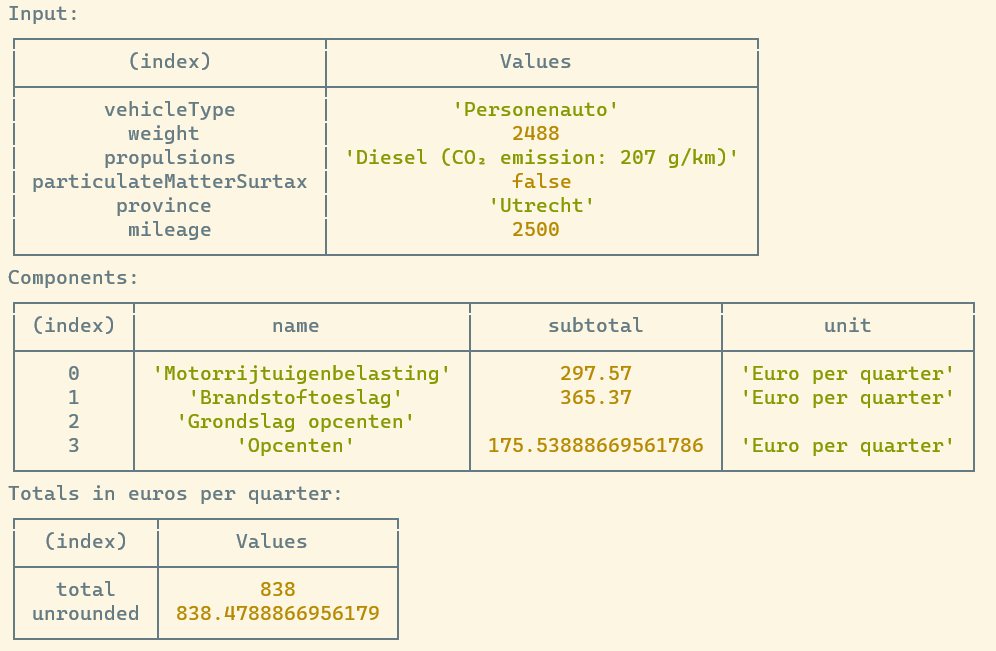

# motorrijtuigenbelasting [](https://www.npmjs.com/package/@motorrijtuigenbelasting/cli)

**Calculate Dutch car tax (motorrijtuigenbelasting) in JavaScript**

> **Note**: **in development**
>
> This module is in development. The implemented rules are tested and verified,
> but quite some rules are not implemented yet. [Contributions](#contributing)
> are very welcome!

---

<center>

<a href="https://autokosten.tools"></a>

Visit <a href="https://autokosten.tools">autokosten.tools</a> to calculate Dutch
car tax.

</center>

---

## Table of contents

<!-- START doctoc generated TOC please keep comment here to allow auto update -->
<!-- DON'T EDIT THIS SECTION, INSTEAD RE-RUN doctoc TO UPDATE -->

- [CLI](#cli)
  - [Usage](#usage)
- [SDK](#sdk)
  - [Installation](#installation)
  - [Usage](#usage-1)
- [Contributing](#contributing)
  - [Implementation status](#implementation-status)
  - [Development](#development)
  - [Devcontainer](#devcontainer)
  - [Credits](#credits)

<!-- END doctoc generated TOC please keep comment here to allow auto update -->

# CLI

## Usage

In the examples below, we use [`yarn dlx`](https://yarnpkg.com/cli/dlx) to run
the CLI. You can also use [`npx`](https://docs.npmjs.com/cli/v9/commands/npx),
it should work exactly the same.

Example with manual input:

```bash
yarn dlx @motorrijtuigenbelasting/cli \
  --vehicle-type Personenauto \
  --weight 1051 \
  --propulsion-type Benzine \
  --co2-emission 86 \
  --province Utrecht
```

Example with vehicle ID (kenteken) as input:

```bash
export RDW_APP_TOKEN=foo
yarn dlx @motorrijtuigenbelasting/cli \
  --vehicle-id S-212-PK
  --province Utrecht
```

Example output:



> **Note**: App token can be obtained after registering at the
> [RDW open data portal](https://opendata.rdw.nl/signup).

# SDK

## Installation

```bash
yarn|npm add @motorrijtuigenbelasting/core @motorrijtuigenbelasting/mrb2023
```

> **Note**: When you want to use a different revision of the car tax law, use
> the corresponding package. See elsewhere in this README to see a list of
> supported revisions.

## Usage

```js
import {
  PropulsionType,
  Province,
  run,
  VehicleType,
} from "@motorrijtuigenbelasting/core";
import mrb2023 from "@motorrijtuigenbelasting/mrb2023";

const params = {
  vehicleType: VehicleType.Personenauto,
  weight: 1051,
  propulsions: [{ type: PropulsionType.Benzine, co2Emission: 86 }],
  province: Province.Utrecht,
};

const results = run(mrb2023, params);

console.log({ results });
```

To obtain params from the RDW from a vehicle ID (kenteken), use the
`@motorrijtuigenbelasting/rdw` package:

```js
import { fetchRdwData, getParamsFromRdw } from "@motorrijtuigenbelasting/rdw";

const vehicleId = "S-212-PK";
const rdwAppToken = "foo";

const rdwData = await fetchRdwData(vehicleId, rdwAppToken);
const params = rdwDataToParams(rdwData);
```

# Contributing

Contributions are very welcome!

## Implementation status

- [x] CLI
- [ ] MRB2023
  - [x] Personenauto
    - [x] Propulsion types
    - [x] Provinces
    - [x] Low emission
    - [x] No emission
  - [x] Bestelauto particulier
    - [x] Propulsion types
    - [x] Particulate matter surtax
    - [x] No emission
  - [ ] Bestelauto gehandicapte
  - [ ] Bestelauto ondernemer
    - [x] Propulsion types
    - [x] Particulate matter surtax
    - [x] No emission
  - [ ] Motor
  - [ ] Aanhangwagen/oplegger
  - [x] Kampeerauto
    - [x] Propulsion types
    - [x] Rented for business purposes
    - [x] Particulate matter surtax
    - [x] No emission
  - [ ] Caravan, vouwwagen of woonwagen
  - [ ] Autobus
  - [ ] Rijdende winkel
  - [ ] Handelaarskenteken
  - [ ] Vrachtauto
- [ ] Convert RDW data
  - [ ] Vehicle type (incomplete)
  - [x] Weight
  - [x] Propulsion types
  - [ ] Particulate matter surtax (incomplete)
- [ ] Betalennaargebruik package
- [ ] Emit warning when there is a known discrepancy between the model and the
      official calculator

See [TODO.md](TODO.md) for known problems which need fixing and general todos.

## Development

To run the `@motorrijtuigenbelasting/cli` package from source, run:

```bash
cd packages/cli
yarn start
```

## Devcontainer

A devcontainer configuration is included in this repo to
[get started quickly](https://code.visualstudio.com/docs/remote/containers#_quick-start-open-an-existing-folder-in-a-container).

## Credits

©️ Copyright 2023 [Joram van den Boezem](https://joram.dev)  
♻️ Licensed under the [MIT license](LICENSE)
